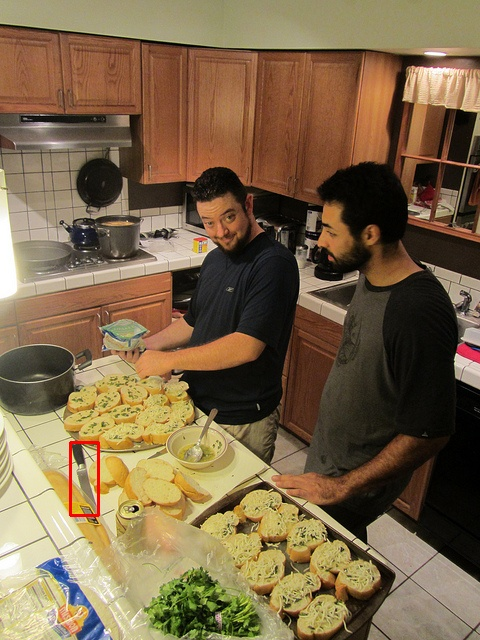

# 🍸️RIO Dataset
This is the official repository for RIO dataset, including dataset downloads, maintenance, baseline method implementation and validation. If you find our dataset helpful in your work, please ⭐star and 📖cite our work.

## 📌Data Example
You can follow the steps in example.ipynb to read and visualize some sample ground truth.

Here is a ground truth example from the dataset: 



The intention description is "you can use the thing to cut the food on the table".

More examples are in the file ./examples.

## 📑Data Format
The annotation contains: 

```
"height": height of the image,
"width": width of the image, 
"image_id": COCO image id,
"task_id": per-intention id, 
"expressions": intention description, e.g., "You can use the thing to cook meal."
"bbox_list": The bbox annotations of all instances of the class that can satisfy the intention.
"mask_list": The mask annotations of all instances of the class that can satisfy intention.
```

## 📁Data Download

### Image
Our dataset is constructed based on COCO2014 dataset, you can download them from [MSCOCO](https://cocodataset.org/), our training set images are from COCO [train](http://images.cocodataset.org/zips/train2014.zip) set, the images of common and uncommon test are from COCO [val](http://images.cocodataset.org/zips/val2014.zip) set.

### Annotation
You can download the latest version of data annotation from [here](https://drive.google.com/drive/folders/1IAvh8tBGS3WWgV4SbVoqhwCkmyoSFffh?usp=drive_link).

## 🧰Baseline Methods
We provide checkpoints for the baseline models, and you can follow the environment configuration details of the original repository and our modified code and scripts to verify the performance of these models on the RIO dataset.
### 1. MDETR & TOIST
TOIST is built on top of the MDETR repository, and there is only a difference between distilled (TOIST) and undistilled (MDETR). We've organized the data into the same format, which you can download from [here](https://drive.google.com/drive/folders/1Vc6BGvjmUvlO1vnFRBPfSzXx8onkkFOZ?usp=drive_link) and put into the *data/coco-tasks/annotations/* directory. 

You can organize the 'data' folder as follows:
```
data/
  ├── id2name.json
  ├── images/
  │    ├── train2014/
  │    └── val2014/
  └── coco-tasks/
       └── annotations/
            ├── refcoco_task_test_common.json
            ├── refcoco_task_test_uncommon.json
            └── refcoco_task_train.json
```

Download the corresponding model checkpoint and run ```bash scripts/test_wo_distill_seg.sh``` to evaluate MDETR, run ```bash scripts/test_w_distill_seg.sh``` to evaluate TOIST. You can choose to evaluate **"common"** or **"uncommon"** at `refexp_test_set` in ```configs/tdod_rio.json```.


| Model | AP50_Det | Top1_Det | mIoU_Seg | Top1_Seg     |Checkpoint     |
| -------- | -------- | -------- | -------- |-------- |-------- |
| MDETR@common     | 48.61     | 65.05     | 44.14     | 54.55     | [link](https://drive.google.com/file/d/1UyZqR13ojW5xi7C9kfZ-04AM2rsp-Wvn/view?usp=drive_link)    |
| MDETR@uncommon     | 24.20     | 39.60     | 22.03     | 34.35     | [link](https://drive.google.com/file/d/1UyZqR13ojW5xi7C9kfZ-04AM2rsp-Wvn/view?usp=drive_link)    |
| TOIST@common     | 49.05     | 66.72     | 45.07     | 55.85     |[link](https://drive.google.com/file/d/1aM1AGhONn-4mNas7KkQlUqd1rwBPRNXq/view?usp=drive_link)     |
| TOIST@uncommon     | 21.96     | 39.28     | 19.41     | 34.00     |[link](https://drive.google.com/file/d/1aM1AGhONn-4mNas7KkQlUqd1rwBPRNXq/view?usp=drive_link)     |


### 2. Polyformer
| Model | mIoU_common | mIoU_uncommon     |Checkpoint     |
| -------- | -------- |-------- |-------- |
| Polyformer     | 46.16     | 26.77     |[link](https://drive.google.com/file/d/1HmCF_JVLZMvbxVqslfiUj5DgaVj_kXT_/view?usp=drive_link)     |

## 🍞Acknowledgement
Data loading and inference scripts are built on [MDETR](https://github.com/ashkamath/mdetr), [TOIST](https://github.com/AIR-DISCOVER/TOIST), [SeqTR](https://github.com/sean-zhuh/SeqTR), [PolyFormer](https://github.com/amazon-science/polygon-transformer) repositories.